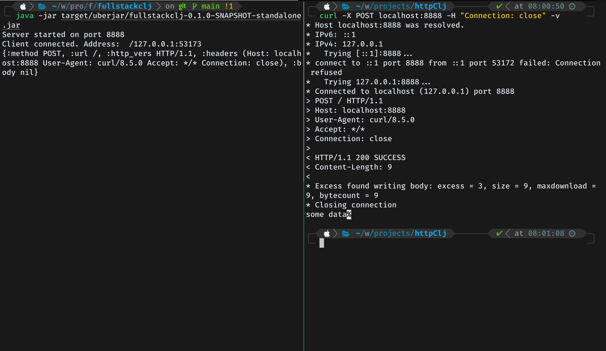

# fullstackclj

## Info

This was project was created for learning purposes

## Goals

`This mainly serves as an accumulation of the knowledge acquired from my cs journey`
### Primary goal
- Combine what I learned from `Programming languages`, `Computer Networks`, `Computer Graphics` and
`Human Computer Interaction` into one real world Application
- Implement an http/rpc application that can handle `10 concurrent connections`, serving
a simple single page web app with auth and some `crud` operations
- The web app will use `ClojureScript`

### Phase 1

- Http and Rpc implementation will be from first principles, using all paradigms supported by `Clojure`
- VanillaJs and HTML will be used to build the web app

### Phase 2

- The application will be updated to use modern frameworks: Java Spring Boot and ReactJs
- FIXME: finalize features

## Architecture

- Uses a simple `MVC` architecture with `MongoDB/Postgres` for data storage
- Pure functional programming

## Installation

### Pre-requisites

1. `Java 22.0.1 OpenJDK`:- [Installation Instructions](https://jdk.java.net/22/)
2. `Leiningen 2.11.2`:- [Installation Instructions](https://wiki.leiningen.org/Packaging)
3.

### Installation steps

1. Clone the repo

```sh
    git clone FIXME: Add repo link && cd fullstackclj
```

2. Compile the app into a single standalone executable jar file

```sh
    lein uberjar
```

## Usage

### Running
For now, this will run the server and listen on port `8888`

```sh
    java -jar target/uberjar/fullstackclj-0.1.0-SNAPSHOT-standalone.jar
```

### Configuration

The `src/fullstackclj/backend/config.clj` can be used to configure some of the server options

## Options

FIXME: listing of options this app accepts.

## Examples

1. Simple request

```sh
    curl -X POST localhost:8888 -H "Connection: close" -v
```



### Bugs

## License

Copyright © 2024 FIXME

This program and the accompanying materials are made available under the
terms of the Eclipse Public License 2.0 which is available at
http://www.eclipse.org/legal/epl-2.0.

This Source Code may also be made available under the following Secondary
Licenses when the conditions for such availability set forth in the Eclipse
Public License, v. 2.0 are satisfied: GNU General Public License as published by
the Free Software Foundation, either version 2 of the License, or (at your
option) any later version, with the GNU Classpath Exception which is available
at https://www.gnu.org/software/classpath/license.html.
