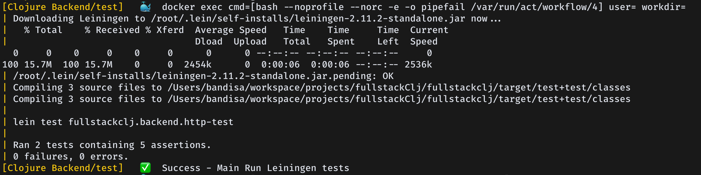

# Development Guide

This document provides instructions on setting up the development environment for our project using Docker.

## Prerequisites

1. `Docker`: Ensure Docker is installed on your machine. You can download and install Docker from [here](https://www.docker.com/products/docker-desktop).
2. `Act`: For running docker actions locally. [Installation](https://nektosact.com/installation/index.html)

## Setting Up the Development Environment

## Usage

`act <GITHUB_ACTION>` will run all workflows triggered by the `<GITHUB_ACTION>`

**example**

`act push`

